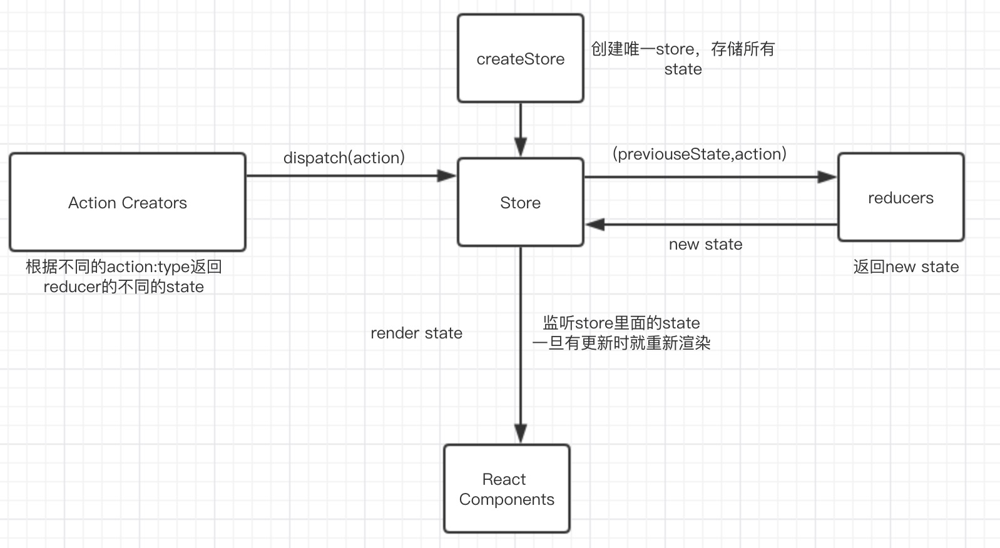

## redux原理-渲染篇

上一篇[redux原理](https://github.com/TypeInfos/redux-demo-01 "console篇") ，用一个console方式讲解redux的原理，既然能在console打印出来，当然也可以在界面渲染出来。

##### 下载&&启动
<pre><code>cd 新文件夹
git clone git@github.com:TypeInfos/redux-demo02.git
cd redux-demo02/my-app
npm install =>安装package.json中的依赖
npm start => 运行
</pre></code>

###### 创建reducer
老样子，还是先创建reducer：

```
const ADD_GUN = '加机关枪'
const REMOVE_GUN = '减机关枪'

export function counter(state=0, action){
    switch(action.type){
        case ADD_GUN:
            return state+1;
        case REMOVE_GUN:
            return state-1;
        default:
            return state;
    }
}

//action creator
export function addGUN(){
    return {type:ADD_GUN}
}
export function removeGUN(){
    return {type:REMOVE_GUN}
}
```
###### action creator：顾名思义，动作创建者，用来返回action.type
在[上一篇](https://github.com/TypeInfos/redux-demo-01"console篇")，我们是用手写type来分发action：

```
store.dispatch({type:ADD_GUN});
```
###### 这边注意下：store.dispatch({type:ADD_GUN});里面的参数对象发送到counter(state=0, action)的action，action的值就是{type:ADD_GUN}，如果store.dispatch({type:ADD_GUN,data:'this is data'});，对应的action就是{type:ADD_GUN,data:'this is data'}。

当我们只有一两个action的话，这样写貌似更省时间，但是要是几十个的话，每次手写就很麻烦而且还要记住各种type的名字，用函数封装起来比较直观，而且用个函数封装起来还可以在里面处理逻辑处理，来判断是否要返回哪个action，比如：

```
function judge(state) {
    if (state>10){
    	return addGUN()
    }else{
    	return removeGUN()
    }
}
```
上面的代码注意意思就是：判断当前state的值是不是大于10，如果大于的就执行增加操作，反之减少。

###### 创建Gun.js

```
import React from 'react';

export default class Gun extends React.Component{
    render(){
        const store = this.props.store;
        return(
            <div>
                <h1>当前有机枪${store.getState()}把</h1>
                <button onClick={()=>{store.dispatch(this.props.addGun())}}>ADD</button>
                <button onClick={()=>{store.dispatch(this.props.removeGun())}}>REMOVE</button>
            </div>
        )
    }
}
```
可以看出，我们是用this.props来调用store、addGun、removeGun，所以我们必须在调用Gun的时候给它传入参数

###### 创建index.js

```
import React from 'react';
import Gun from './Gun'

export default class Show extends React.Component{
    render(){
        return(
            <Gun store={this.props.store}
            addGun={this.props.addGun} 
            removeGun={this.props.removeGun} />
        )
    }
}
```
可以看出，我们这里调用了Gun，并给它传入这些props，但是它的props又是上一级传的，也就是src下面的index.js

```
import Show from './gun/index';
import {createStore} from 'redux';
import {counter} from './gun/Gun.reducer'
import { addGUN, removeGUN } from './gun/Gun.reducer';

const store = createStore(counter,10);

store.subscribe(render);

render();
function render() {
    ReactDOM.render(<Show store={store} addGun={addGUN} removeGun={removeGUN} />, 
        document.getElementById('root'));
}
```
终于到尽头了，还是一样的，store.subscribe(render)用来订阅这个render（）函数，一旦store里面的state发生改变，就执行render，相当于重新渲染了一遍。

但是有会说为什么props要一级一级传下去：
###### src/index.js->gun/index.js->gun/Gun.js(src、gun文件名)
为什么不直接在Gun.js直接导入直接使用呢？这是因为react的理念：组件之间联系越紧密，其耦合性就越强，模块的独立性则越差，也就是低耦合，做到低耦合才能实现组件复用。但是props一级一级传有点浪费资源。

这也导致react-redux这个库的出现，里面的Provide的实现原理用了react的[Context](https://reactjs.org/docs/context.html"react-context")，让props直接传到需要的子组件。

### 这是我现在对redux的理解：


